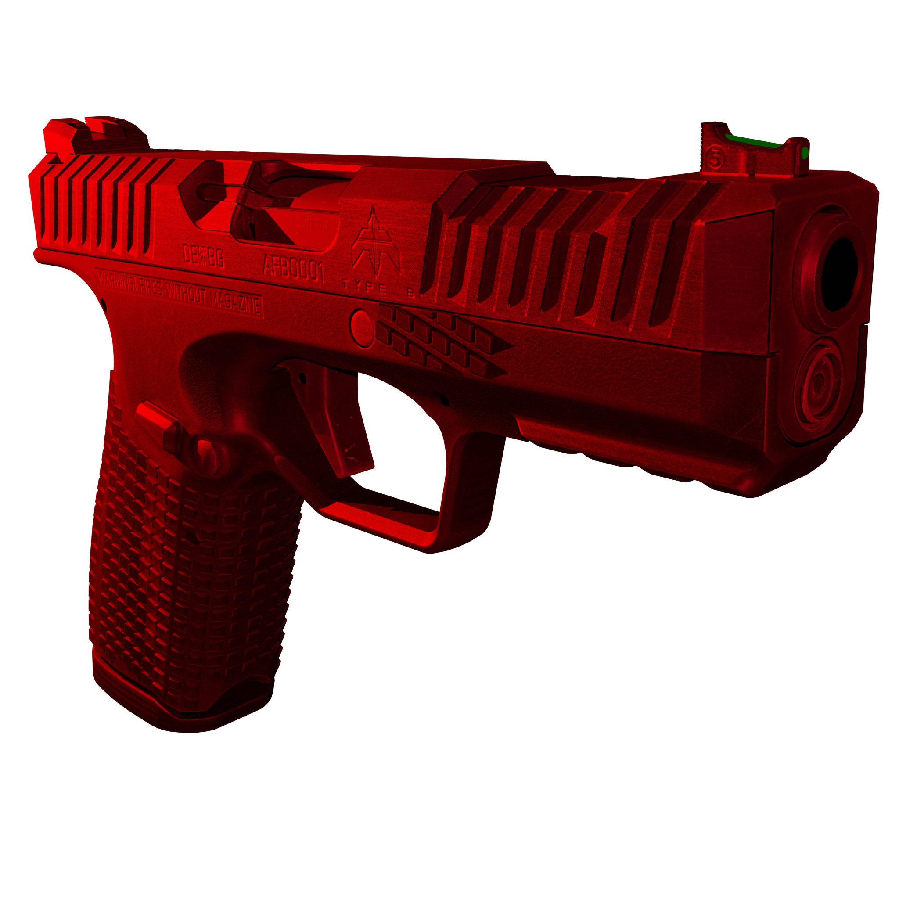
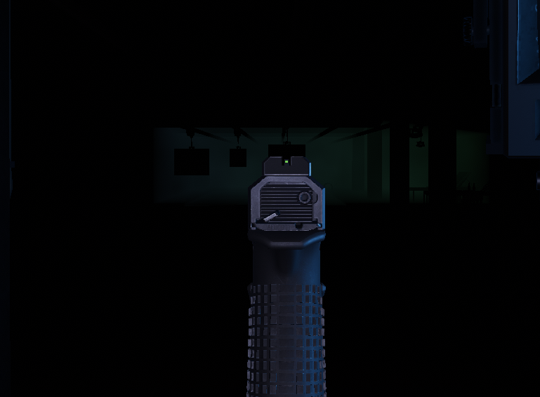
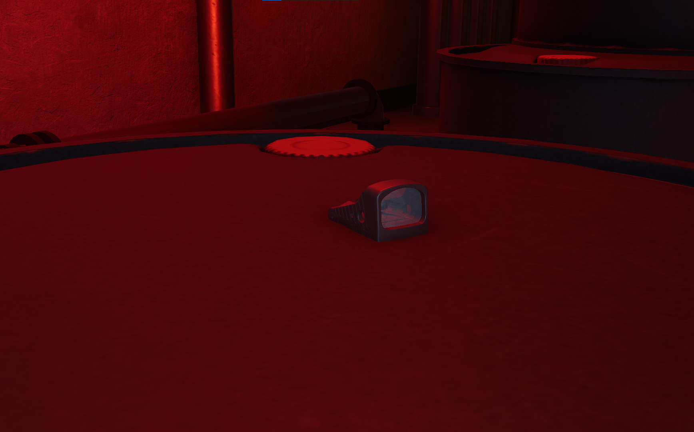
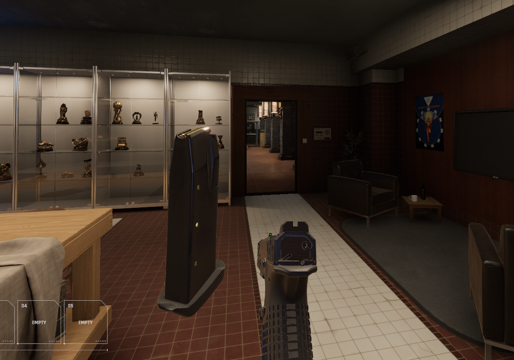

# Archon Firearms Stryk B

A tactical pistol for Receiver 2 

## What is it?

A striker fired pistol without a manual safety, developed by italian company Arsenal Firearms from cooperation with russian FSB "Alpha" special forces group

## Features

 - Accurate and low recoil pistol with tritium front sight  
 

 - A mountable red dot sight that can be found in the Dreaming or spawned in the Compound  
 

 - Magazines with 15 (standard) or 6 (reduced) rounds capacity  
 

## Installation

### Using Thunderstore

Go to [gun's Thunderstore page](https://thunderstore.io/c/receiver-2/p/Szikaka/Stryk_B_Mod/) and download the archive containing the mod

There should be 2 folders in the archive: <b>Stryk B Files</b> and <b>Stryk B Plugin</b>

Unpack <b>Stryk B Files</b> to your application data folder:

%UserProfile%\AppData\LocalLow\Wolfire Games\Receiver2\Guns - Windows

~\Library\Application Support\Wolfire Games\Receiver2\Guns – Mac OS

~.config_unity3d\Wolfire Games\Receiver2\Guns – Linux

Unpack <b>Stryk B Plugin</b> to your BepInEx plugins folder at \<SteamDir>\\Receiver 2\\BepInEx\\plugins
(If you don't have BepInEx, you can download it from its [github repo](https://github.com/BepInEx/BepInEx/releases/tag/v5.4.21))

### Manually

Go to [the releases section](https://github.com/Szikaka-97/StrykBMod/releases) and download files labeled for your OS from the latest release.

There should be 2 folders in the archive: <b>Stryk B Files</b> and <b>Stryk B Plugin</b>

Unpack <b>Stryk B Files</b> to your application data folder:

%UserProfile%\AppData\LocalLow\Wolfire Games\Receiver2\Guns - Windows

~\Library\Application Support\Wolfire Games\Receiver2\Guns – Mac OS

~.config_unity3d\Wolfire Games\Receiver2\Guns – Linux

Unpack <b>Stryk B Plugin</b> to your BepInEx plugins folder at \<SteamDir>\\Receiver 2\\BepInEx\\plugins
(If you don't have BepInEx, you can download it from its [github repo](https://github.com/BepInEx/BepInEx/releases/tag/v5.4.21))

## How to?

### Spawn

To use the gun in the Dreaming open the debug menu (Pause the game -> Ctrl + F12) and navigate to File -> Custom Campaign -> Stryk B Campaign -> Desired rank

To use the gun in the Compound open the debug menu (Pause the game -> Ctrl + F12) and navigate to Debug -> Spawn -> Items -> szikaka.stryk_b_custom_slide and 3 items under it

### Basic controls

Same as the Glock

### Red dot sight

The sight can be found in the Dreaming or spawned via Debug -> Spawn -> Items -> szikaka.stryk_b_rds

To attach it, press the key specified in Settings Menu -> Keybinds -> Modded Gun Keybinds -> Archon Firearms Stryk B -> Attach RDS (Default: Hammer key)

To detach it, press the key specified in Settings Menu -> Keybinds -> Modded Gun Keybinds -> Archon Firearms Stryk B -> Detach RDS (Default: Safety key)
